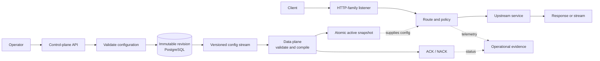

<div align="center">

# GateHouse

### Make gateway correctness visible.

A production-minded Layer 7 gateway in Go, designed around protocol correctness, safe configuration rollouts, and predictable failure behavior.

**Go:** 1.26.8 · **Contracts:** Protobuf · **CI:** [GitHub Actions](https://github.com/SShogun/GateHouse/actions/workflows/ci.yml)

</div>

> **Project state: M1 complete — static HTTP proxy and cancellation.** The data plane forwards traffic to one configured upstream; M1 tests cover forwarding semantics, informational responses, cancellation cleanup, streaming memory, hop-by-hop headers, and graceful drain. Dynamic routing, configuration storage, and publication are not implemented yet.

[What exists](#what-works-today) · [Run checks](#try-the-current-foundation) · [Target architecture](#target-architecture) · [Roadmap](#roadmap) · [Docs](#repository-map)

---

## The idea

Gateways are easy to describe as boxes and hard to get right at the edges. A client disconnect must stop upstream work. A config update must not expose a half-built state. A streamed response must remain streamed. Retries must not turn an outage into a traffic multiplier.

GateHouse is being engineered in small, reviewable increments, with executable tests for the guarantees that matter under real traffic instead of relying on architecture diagrams alone.

Its eventual boundary is deliberately split:

- **Control plane:** validates configuration, stores immutable revisions, publishes updates, and tracks data-plane status.
- **Data plane:** serves requests from a compiled local configuration snapshot; normal request handling does not depend on PostgreSQL or a synchronous control-plane call.
- **Operator console:** a future interface for configuration and operational state.

## What works today

The current milestone is intentionally small. The repository provides:

- separate Go command entry points for `gatehouse-control` and `gatehouse-data`;
- a static HTTP reverse proxy in `gatehouse-data`, with bounded server defaults and graceful shutdown;
- SIGINT/SIGTERM handling, root cancellation, and bounded shutdown coordination;
- a `gatehouse.v1` Protobuf workspace with committed Go and TypeScript generated output;
- Buf linting, compatibility checks, and generated-code drift checks;
- an executable compatibility fixture that proves Buf rejects a removed field and accepts a compatible addition;
- separate CI jobs for contracts, static analysis, unit tests, race tests, and vulnerability scanning.

The data-plane binary listens on `127.0.0.1:8080` and forwards every request to `http://127.0.0.1:8081` by default. Set `GATEHOUSE_LISTEN_ADDR` and `GATEHOUSE_UPSTREAM_URL` to override these in-process static settings. The control-plane binary remains a lifecycle scaffold. The Protobuf package is a contract workspace, not a completed application API.

## Target architecture

This is the destination described by the architecture docs—not a claim that these components are already implemented.



The critical separation: the control plane owns durable configuration and publication; the data plane owns the request path and continues serving from its active snapshot when the control plane or database is unavailable.

## Try the current foundation

### Requirements

- Git
- Go 1.26.8 (the `go.mod` toolchain directive is authoritative)
- Buf CLI 1.73.0
- `make`
- Network access on the first verification run to download pinned analysis tools and Buf generators

### Clone and verify

```bash
git clone https://github.com/SShogun/GateHouse.git
cd GateHouse
make verify
```

`make verify` runs formatting checks, `go vet`, Staticcheck, Buf lint and breaking checks, the negative compatibility fixture, generated-code drift detection, module verification, unit tests, race tests, and `govulncheck`.

### Run the static data-plane proxy

```bash
GATEHOUSE_LISTEN_ADDR=127.0.0.1:8080 \
GATEHOUSE_UPSTREAM_URL=http://127.0.0.1:8081 \
go run ./cmd/gatehouse-data
```

The proxy preserves the request method, path, end-to-end headers, and body; forwards response status, end-to-end headers, and body; strips hop-by-hop headers; propagates request cancellation; and streams response chunks without waiting for the full upstream body. It is a single static upstream, with no route matching or retries. SIGINT (`Ctrl+C`) and SIGTERM stop new requests and drain in-flight requests within the shutdown timeout. The control-plane scaffold can be started with `go run ./cmd/gatehouse-control` and currently waits for a shutdown signal.

## The proof bar

GateHouse treats correctness as observable behavior. The current test foundation proves lifecycle ordering and cancellation, and the contract fixture runs Buf against both a breaking and a compatible revision. As request-handling milestones arrive, the proof suite grows with the behavior: real HTTP clients and upstreams, cancellation propagation, streaming, race/leak checks, fault injection, and bounded-resource evidence.

No protocol is considered supported because a happy-path demo happened to work. The roadmap requires real HTTP/1.1 and HTTP/2 behavior, Connect/gRPC status and trailer semantics, and streaming/cancellation tests before those claims are made.

## Roadmap

The sequence is dependency-ordered. A later milestone does not begin just because its code exists; it begins when the preceding gate has evidence.

| Milestone | Focus |
| --- | --- |
| M0 | Repository bootstrap, Protobuf contracts, lifecycle, and CI floor |
| M1 | Static HTTP proxy and cancellation |
| M2 | Deterministic routing, clusters, load balancing, and health |
| M3 | Control plane, revisions, and atomic hot reload |
| M4 | HTTP/2, Connect, gRPC, trailers, and streaming |
| M5 | Deadlines, retries, budgets, admission, and circuit breaking |
| M6 | Authentication, rate limiting, TLS, and mTLS |
| M7 | Observability and operator UI |
| M8 | Failure campaign, load, performance, and resource hardening |
| M9 | Compatibility, release, and reproducibility |

See the [execution plan](docs/Gatehouse_PLAN.md) for each milestone's RED/GREEN gates and exact scope.

## Repository map

```text
api/gatehouse/v1/          Protobuf API namespace
cmd/gatehouse-control/     Control-plane process entry point
cmd/gatehouse-data/        Data-plane process entry point
gen/go/                    Committed Go Protobuf bindings
gen/ts/                    Committed TypeScript Protobuf bindings
internal/lifecycle/        Signal, root-context, and shutdown coordination
scripts/                   Contract compatibility proof
tests/fixtures/proto-compat/ Baseline, breaking, and compatible contracts
docs/                      Architecture, decisions, roadmap, testing/CI
.github/workflows/ci.yml   Separate, visible M0 CI gates
Makefile                   Local verification commands
```

Start with the doc that answers your question:

| If you want to understand… | Read… |
| --- | --- |
| System boundaries and invariants | [Architecture](docs/Gatehouse_ARCHITECTURE.md) |
| Why key technical choices were made | [Decisions](docs/Gatehouse_DECISIONS.md) |
| What comes next and what must pass | [Execution plan](docs/Gatehouse_PLAN.md) |
| How behavior is tested and CI is structured | [Testing and CI](docs/Gatehouse_TESTING_CI.md) |

## Design priorities

GateHouse is being built around a request path that can keep working independently of the control plane, configuration changes that can be validated before they become active, and protocol behavior that is verified with tests. Those constraints guide the implementation as the gateway grows from its current foundation.

## Contributing

Changes should be narrow, tested, and consistent with the active milestone. Before opening a pull request, run:

```bash
make verify
```

For behavior changes, add a test that demonstrates the missing behavior before the fix. Generated bindings are committed; if a Protobuf source changes, regenerate with `buf generate` and include the resulting output.
